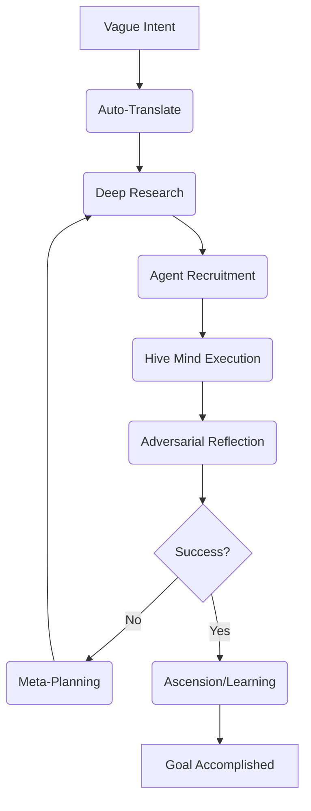

# 🌌 Ω-SINGULARITY v3 — The Autonomous AI Orchestrator    

> **"You give it a goal. It thinks, researches, hires agents, executes commands, critiques itself, evolves its own code, and reports back. No Manus. No handholding."**

Ω-SINGULARITY is not just an AI; it's a **Self-Evolving Cognitive Engine** for the Tri-Core Mesh (Nova, Luna, Aura). Built with the **Zero-Manus Doctrine**, it assumes the entire cognitive burden of software development and security research.

---

## 🚀 The Silent Factory (10-Phase Loop)

Omega operates on a recursive cycle of intelligence that transforms vague intent into production-ready reality.

---

## ⚡ Core Powers (v3.0.0)

| Feature | Description |
| :--- | :--- |
| **Autonomous Terminal** | Full control over system commands, package managers, and process monitoring. |
| **Agent Recruiter** | Hunts GitHub, HuggingFace, and LLM providers to "hire" specialized agent workers. |
| **Security Arsenal** | Native integration with `nmap`, `metasploit`, `nikto`, `sqlmap`, and `hydra`. |
| **Web Researcher** | Deep-internet scraping for live context from GitHub, StackOverflow, and Wikipedia. |
| **Ascension Engine** | Automatically extracts code patterns and logic to permanently upgrade its own skills. |
