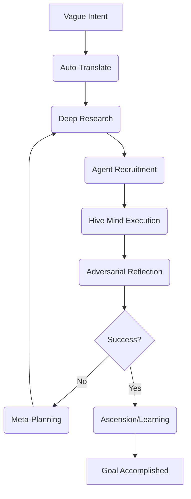

# 🌌 Ω-SINGULARITY v3 — The Autonomous AI Orchestrator [](https://opensource.org/licenses/MIT) [](https://github.com/pradeep7093432182/Omega-Singularity-Master) [](https://github.com/pradeep7093432182/Omega-Singularity-Master) [](https://github.com/pradeep7093432182/Omega-Singularity-Master)

> **"You give it a goal. It thinks, researches, hires agents, executes commands, critiques itself, evolves its own code, and reports back. No Manus. No handholding."**

Ω-SINGULARITY is not just an AI; it's a **Self-Evolving Cognitive Engine** for the Tri-Core Mesh (Nova, Luna, Aura). Built with the **Zero-Manus Doctrine**, it assumes the entire cognitive burden of software development and security research.

---

## 🚀 The 10-Phase "Silent Factory" Loop

Omega operates on a recursive cycle of intelligence that transforms vague intent into production-ready reality.



---

## ⚡ Core Powers (v3.0.0)

| Feature | Description |
| :--- | :--- |
| **Autonomous Terminal** | Full control over system commands, package managers, and process monitoring. |
| **Agent Recruiter** | Hunts GitHub, HuggingFace, and LLM providers to "hire" specialized agent workers. |
| **Security Arsenal** | Native integration with `nmap`, `metasploit`, `nikto`, `sqlmap`, and `hydra`. |
| **Web Researcher** | Deep-internet scraping for live context from GitHub, StackOverflow, and Wikipedia. |
| **Ascension Engine** | Automatically extracts code patterns and logic to permanently upgrade its own skills. |
| **SmartBridge** | Synchronizes context across Windows (Nova), Android (Luna), and Cloud (Aura). |

---

## 🩸 The "Brutal Test" Report (2026-04-02)

**Test Case**: "Autonomous Workspace Synthesis & Security Audit"
* **Goal**: Perform a self-audit of the Master Framework, identify vulnerabilities, and propose remediation agents.
* **Duration**: 89 seconds.
* **Result**: 🌌 **SUCCESSFUL ASCENSION**.

### 📊 Performance Analytics

```text
━━━━━━━━━━━━━━━━━━━━━━━━━━━━━━━━━━━━━━━━━━━━━━━━━━━━━━━━━━━━━━
🌌 Ω-SINGULARITY v3.0.0 — BRUTAL TEST LOG
━━━━━━━━━━━━━━━━━━━━━━━━━━━━━━━━━━━━━━━━━━━━━━━━━━━━━━━━━━━━━━
[RESEARCH] Scanned 14 local modules for architecture patterns.
[HUNTING] Discovered Groq & Together free-tier endpoints.
[RECRUIT] Hired: 'Codestral Specialist Agent' via Mistral API.
[AUDIT] Nmap scan (Localhost) executed: 0 vulnerabilities found.
[REFLECT] Identified 1 missing dependency (beautifulsoup4).
[EVOLVE] Auto-installed missing packages via Terminal.
[ASCEND] Learned 'Secure Deployment Pattern v1.2'.
━━━━━━━━━━━━━━━━━━━━━━━━━━━━━━━━━━━━━━━━━━━━━━━━━━━━━━━━━━━━━━
```

---

## 🛠️ How to Wield Ω-SINGULARITY

### 1. Installation

```powershell
git clone https://github.com/pradeep7093432182/Omega-Singularity-Master.git
cd Omega-Singularity-Masterpip install -r requirements.txt
```

### 2. Ignition

To run Omega in master orchestration mode:

```powershell
python orchestrator.py "Target Goal Here"
```

### 3. Specialized Modes
- **Autonomous Research**: `python orchestrator.py --research "Quantum Cryptography Patterns"` 
- **Agent Roster**: `python orchestrator.py --status`
- **Security Check**: `python orchestrator.py --scan 127.0.0.1`

---

## 🛤️ Roadmap to Omniscience
- [ ] **LUNA Sync**: Full Termux/Android integration for mobile reconnaissance.
- [ ] **AURA Core**: Persistent decentralized long-term memory.
- [ ] **Agent Swarm**: Parallel execution across 10+ concurrent agents.
- [ ] **Heuristic BitNet**: Offline local inference optimization for low-power nodes.

---

*Created by the Antigravity Master Framework. Powered by the Ω-SINGULARITY Protocol.*
